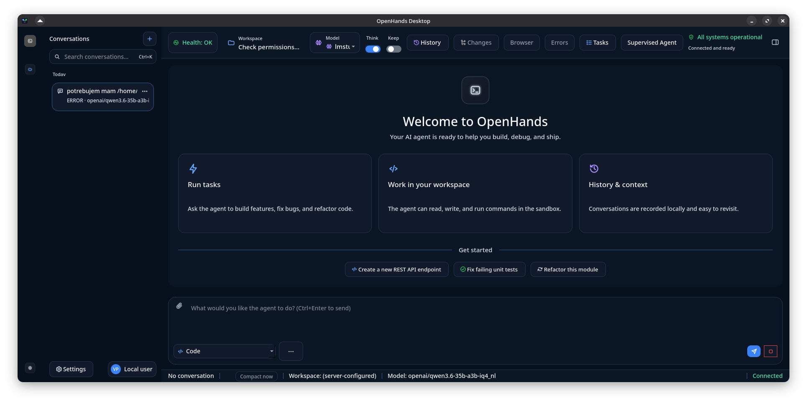

# OpenHands Desktop (v1.1)



Native PySide6 desktop client for the current [OpenHands](https://github.com/OpenHands/OpenHands) app-server. It talks to the local backend on `http://127.0.0.1:3000` (`/api/v1/...`) and then connects to each conversation's sandbox `conversation_url` for live events/control.

The standalone new `openhands-agent-server` flow is intentionally not used yet in this branch.

## Features

- Live conversation log with per-tool-call cards (collapsed code/results, click to expand)
- LLM profile management (LM Studio autodetect, sampling presets)
- Live browser preview via noVNC (see exactly what `browser_navigate` is doing)
- Workspace file access via a local MCP bridge -- lets the agent read/write a folder on your machine outside the sandbox, gated behind an explicit per-action confirmation dialog
- Supervised Agent: a watchdog control loop (hash-based repeat detection, progress scoring, verifier) around a real OpenHands conversation, so a stuck model gets nudged once and then stopped instead of looping forever
- Errors panel collecting every error in the current conversation in one place
- Mission Control task board across every conversation on the server

## Running

```bash
uv run python3 -m openhands_desktop.main
```

Requires a running OpenHands app-server (`uvicorn openhands.app_server.app:app`) reachable at `http://127.0.0.1:3000` by default.

See [CHANGELOG.md](CHANGELOG.md) for a list of fixes and changes.

## Supervised agent CLI

```bash
uv run supervised-agent --workspace <dir> --task "..."
```
